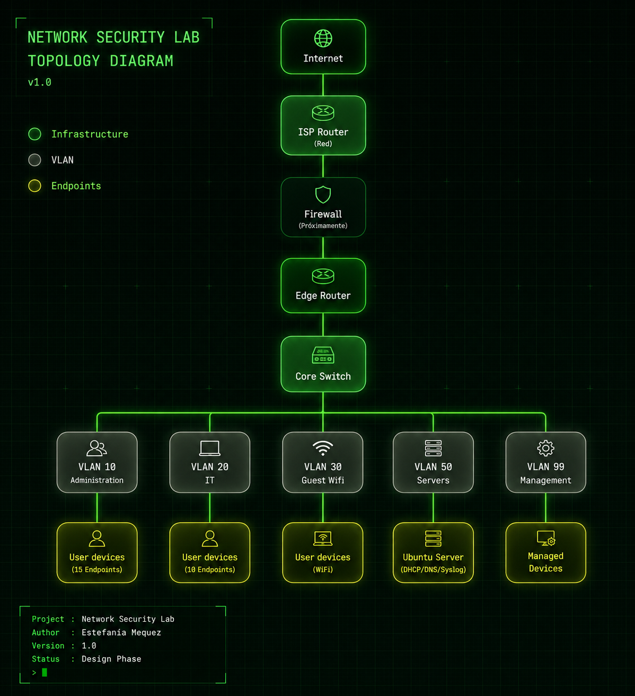

# Network Security Lab - TheKithub

Este proyecto documenta el diseño e implementación de una red empresarial simulada utilizando GNS3, Cisco IOS y Ubuntu Server. 

## 📌 Objetivos

Reforzar y aplicar conceptos de redes, infraestructura y ciberseguridad mediante la construcción incremental de un laboratorio que incorpora nuevas funcionalidades en cada etapa, orientado a escenarios reales de una organización. 
 
## Diagrama de la topología

La siguiente imagen representa la infraestructura base del laboratorio. A medida que avance el proyecto se incorporarán nuevos servicios y mecanismos de seguridad. 

## 🛠️ Tecnologías utilizadas

- Cisco IOS
- GNS3 
- Ubuntu Server
- VMware
- Wireshark

## ⚙️ Funcionalidades

- VLAN Segmentation 
- Inter-VLAN Routing (Router-on-a-Stick) 
- DHCP 
- DNS 
- NAT / PAT 
- ACLs 
- SSH 
- Port Security 
- AAA 
- Firewall 
- Análisis de tráfico
- Troubleshooting 

## Roadmap

| Semana           | Estado                                     |
|---------------|-------------------------------|
| ✅ Semana 1 | Vlans + RoaS + DHCP |
| ⏳ Semana 2 | Infraestructura completa + DNS + NAT |
| ⏳ Semana 3 | ACL + SSH + Hardening |
| ⏳ Semana 4 | Syslog + NTP + SNMP + AAA |
| ⏳ Semana 5 | Firewall + NAT/PAT + ACL Perimetral |

## 📚 Documentación

Cada etapa del proyecto se documenta de forma independiente, incluyendo el diseño, la implementación y las pruebas realizadas. 

- 📁 Semana 1 → [Ver documentación](Semana1/README.md)
- 📁 Semana 2 →

## Estado del proyecto 

🚧 En desarrollo. 

Este laboratorio está en construcción y continuará ampliándose con nuevas tecnologías y escenarios.

