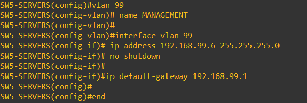

# Red de Management

## 📌Objetivo

Se implementó la **VLAN 99 - MANAGEMENT** como una red dedicada para la administración de los dispositivos de infraestructura.

El objetivo es separar el direccionamiento utilizado para gestionar routers y switches del tráfico generado por usuarios y servicios, dejando preparada una red específica que más adelante podrá utilizarse para acceso administrativo mediante SSH y para aplicar controles de seguridad sobre la gestión de los dispositivos.

Cada equipo de red recibió una dirección IP fija dentro de la red:

```text
192.168.99.0/24
```

El gateway de la VLAN corresponde a la subinterfaz configurada en `R1-EDGE`:

```text
192.168.99.1
```
---
## Implementación / configuración

### Direccionamiento de Management

Se definió el siguiente esquema de direccionamiento:

| Dispositivo    | IP de Management |
| -------------- | ---------------- |
| R1-EDGE        | `192.168.99.1`   |
| SW1-CORE       | `192.168.99.2`   |
| SW2-ADMIN      | `192.168.99.3`   |
| SW3-IT         | `192.168.99.4`   |
| SW4-GUEST      | `192.168.99.5`   |
| SW5-SERVERS    | `192.168.99.6`   |
| SW6-MANAGEMENT | `192.168.99.7`   |

En `R1-EDGE`, la VLAN 99 ya forma parte del esquema RoaS utilizado para el enrutamiento entre VLANs con la dirección 192.168.99.1 que funciona como gateway de Management

```cisco
interface GigabitEthernet0/0.99
 encapsulation dot1Q 99
 ip address 192.168.99.1 255.255.255.0
```

---
### Configuración de Management en los switches

En cada switch se creó la VLAN 99 y se configuró una **SVI** con una dirección IP propia.

Por ejemplo, en `SW3-IT`:

```cisco
vlan 99
 name MANAGEMENT

interface Vlan99
 ip address 192.168.99.4 255.255.255.0
 no shutdown
```
Como los switches funcionan como dispositivos de Capa 2, se configuró `R1-EDGE` como gateway para alcanzar otras redes:

```cisco
ip default-gateway 192.168.99.1
```



El mismo esquema se replicó en el resto de los switches utilizando la dirección correspondiente a cada dispositivo.

---
### Transporte de VLAN 99 por los trunks

Para que las interfaces de Management puedan comunicarse con `R1-EDGE`, la VLAN 99 debe atravesar los enlaces trunk entre los switches de acceso y `SW1-CORE`.

Se mantuvieron únicamente las VLANs necesarias en cada enlace.

Por ejemplo, en `SW3-IT`:

```cisco
interface GigabitEthernet0/0
 switchport mode trunk
 switchport trunk allowed vlan 20,99
```

De esta manera, la VLAN de usuarios correspondiente a cada segmento comparte el enlace trunk con la VLAN dedicada a Management sin transportar VLANs innecesarias.

---
## Verificación

Para comprobar el estado de las interfaces de Management se utilizó:

```cisco
show ip interface brief
```

Por ejemplo, en `SW3-IT`:

```text
Vlan99    192.168.99.4    YES NVRAM    up    up
```

También se verificó que VLAN 99 estuviera habilitada y activa:

```cisco
show interfaces trunk
```

y que Spanning Tree la estuviera transportando en estado de forwarding:

```cisco
show spanning-tree vlan 99
```

---
## Prueba de conectividad

Una vez configuradas las interfaces de Management, se verificó el acceso a los dispositivos desde una VLAN diferente.

Por ejemplo, un cliente ubicado en la VLAN 20 pudo comunicarse correctamente con la dirección de Management de `SW3-IT`:

```text
PC-Admin
192.168.20.x
     │
     ▼
R1-EDGE
192.168.20.1
     │
     │ Inter-VLAN Routing
     ▼
VLAN 99
     │
     ▼
SW3-IT
192.168.99.4
```

Esta prueba permite comprobar que la red de Management no solamente funciona dentro de su propio segmento, sino que también puede ser alcanzada a través del enrutamiento definido en `R1-EDGE`.


---
## 🏁Resultado

Al finalizar esta etapa, todos los routers y switches del laboratorio cuentan con una dirección IP dedicada para administración dentro de la **VLAN 99**.

La red `192.168.99.0/24` queda reservada para funciones de gestión de infraestructura, **separada de las VLANs utilizadas por usuarios, invitados y servidores**

Esta implementación también deja preparada la infraestructura para las siguientes etapas del proyecto, donde el acceso administrativo podrá realizarse mediante **SSH** y limitarse posteriormente mediante **ACLs y políticas de seguridad**.

  ## ⏩Próximos pasos 

  En la siguiente etapa se implementará DNS. [Ir a la siguiente sección](03-DNS-interno.md)
