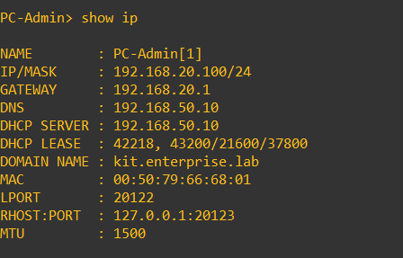
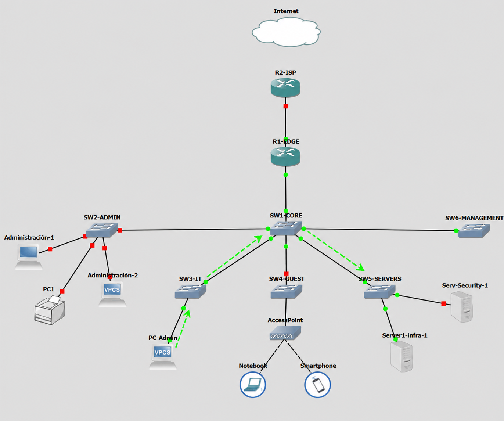

# DNS interno

## 📌Objetivo

Se incorporó un servicio de **DNS interno** para permitir que los dispositivos de la infraestructura puedan ser identificados mediante nombres en lugar de depender únicamente de sus direcciones IP.

El servicio se integró en `Serv1-infra`, utilizando el servidor ubuntu donde también funciona DHCP.

```text
kit.enterprise.lab
```

El objetivo principal de esta etapa fue centralizar la resolución de nombres de los dispositivos de infraestructura y distribuir automáticamente el servidor DNS a los clientes mediante DHCP.

---

## Implementación / configuración

### Dominio interno

En el servidor de infraestructura se agregó la configuración DNS deifniendo `kit.enterprise.lab` como dominio local:

```conf
domain=kit.enterprise.lab
local=/kit.enterprise.lab/
```

Esto permite que las consultas correspondientes a este dominio sean resueltas directamente por el servidor DNS interno.

---

### Registros de infraestructura

Se crearon registros estáticos para los principales dispositivos del laboratorio:

```conf
host-record=serv1-infra.kit.enterprise.lab,192.168.50.10

host-record=r1-edge.kit.enterprise.lab,192.168.99.1
host-record=sw1-core.kit.enterprise.lab,192.168.99.2
host-record=sw2-admin.kit.enterprise.lab,192.168.99.3
host-record=sw3-it.kit.enterprise.lab,192.168.99.4
. . .
```

De esta manera, los equipos pueden ser identificados mediante nombres consistentes con sus hostnames.

---

### Distribución del servidor DNS mediante DHCP

Los clientes reciben automáticamente `192.168.50.10` como servidor DNS a través de DHCP.

Por ejemplo:

```conf
dhcp-option=tag:vlan20,6,192.168.50.10
```

La misma opción se encuentra configurada para el resto de las redes que utilizan DHCP.

Además, al definir:

```conf
domain=kit.enterprise.lab
```

los clientes reciben también el dominio interno asociado a la red.

---

## ✅ Verificación

Desde el propio servidor se realizó una consulta directamente contra `192.168.50.10`:

```bash
nslookup sw3-it.kit.enterprise.lab 192.168.50.10
```

La respuesta obtenida fue:

```text
Name:    sw3-it.kit.enterprise.lab
Address: 192.168.99.4
```

Confirmando que el registro se encuentra disponible en el DNS interno.

---
## 🔌 Prueba de conectividad

Para validar el funcionamiento desde un cliente real de la red, se utilizó PC-Admin que está ubicada en una VLAN distinta a la de Servidores y Management.

El cliente recibió su ip, gateway, y domain name automáticamente por DHCP:



Luego se utilizó directamente el FQDN del switch:

```text
ping sw5-it.kit.enterprise.lab
```

El cliente pudo resolver dns y comunicarse 

```text
sw5-it.kit.enterprise.lab → 192.168.99.4
```

  

Esta prueba permite validar en una misma operación la entrega del servidor DNS mediante DHCP, la resolución del nombre interno y la comunicación con el destino utilizando su FQDN.

---
## 🏁 Resultado

El laboratorio cuenta ahora con un dominio DNS interno centralizado

```text
kit.enterprise.lab
```

Los principales dispositivos de infraestructura pueden ser identificados mediante nombres consistentes, mientras que los clientes reciben automáticamente la dirección del servidor DNS mediante DHCP.

Esto simplifica la identificación y administración de los recursos del laboratorio y deja preparada la infraestructura para utilizar nombres de host en servicios que se incorporen en etapas posteriores.


 ## ⏩Próximos pasos 

  En la siguiente etapa se implementará NAT. [Ir a la siguiente sección](04-NAT.md)
