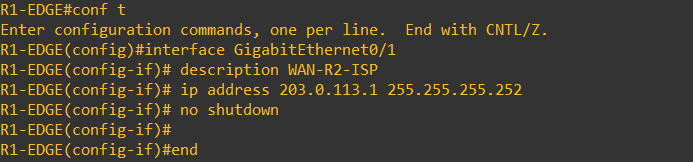
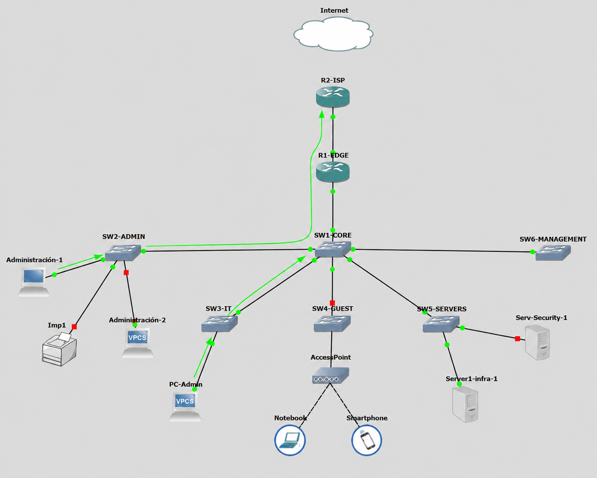
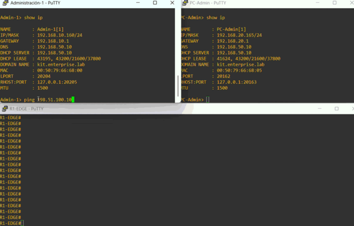

# NAT/PAT

## 📌Objetivo

En esta etapa se implementó conectividad hacia una **red externa simulada**, utilizando `R2-ISP` como proveedor y `R1-EDGE` como punto de salida de la red interna.

El objetivo fue permitir que los equipos con direccionamiento privado puedan comunicarse con destinos externos utilizando **PAT**.

La idea es que dispositivos de distintas VLANs pueden compartir una única dirección IP externa.

---
## Implementación / configuración

### Enlace hacia el ISP

Se utilizó la red:

```text
203.0.113.0/30
```

para conectar ambos routers:

| Dispositivo | Interfaz | Dirección        |
| ----------- | -------- | ---------------- |
| R1-EDGE     | Gi0/1    | `203.0.113.1/30` |
| R2-ISP      | Gi0/0    | `203.0.113.2/30` |

En `R1-EDGE` y R2-ISP:



Para representar un destino externo se configuró una Loopback en `R2-ISP`:

```cisco
interface Loopback0
 description SIMULACION_INTERNET_HOST
 ip address 198.51.100.10 255.255.255.255
```

---
### Ruta por defecto

En `R1-EDGE` se agregó una ruta por defecto apuntando hacia el ISP:

```cisco
ip route 0.0.0.0 0.0.0.0 203.0.113.2
```

---
### Definición de interfaces NAT

Se configuraron todas las subinterfaces correspondientes a las VLANs internas como interfaces NAT **inside**:

```cisco
interface GigabitEthernet0/0.10
 ip nat inside

interface GigabitEthernet0/0.20
 ip nat inside

interface GigabitEthernet0/0.30
 ip nat inside

interface GigabitEthernet0/0.50
 ip nat inside

interface GigabitEthernet0/0.99
 ip nat inside
```

La interfaz conectada al ISP fue definida como **outside**:

```cisco
interface GigabitEthernet0/1
 ip nat outside
```

---
### Selección de las redes internas

Se creó una ACL estándar para identificar las redes cuyos paquetes pueden ser traducidos por NAT y poder realizar la traducción dinámica. 

```cisco
ip access-list standard NAT_INSIDE
 permit 192.168.10.0 0.0.0.255
 permit 192.168.20.0 0.0.0.255
 permit 192.168.30.0 0.0.0.255
 . . .
```
Finalmente se habilitó PAT utilizando la dirección de la interfaz externa de `R1-EDGE`:

```cisco
ip nat inside source list NAT_INSIDE interface GigabitEthernet0/1 overload
```
---

## ✅ Verificación
Para comprobar el estado de NAT se utilizaron:

```cisco
show ip nat translations
```
y:

```cisco
show ip nat statistics
```

La tabla de traducciones permitió observar simultáneamente tráfico originado desde equipos de diferentes VLANs:

```text
Inside global       Inside local
203.0.113.1:1356    192.168.10.160:1356
203.0.113.1:8012    192.168.20.165:8012
```

Ambos dispositivos utilizan la misma dirección externa de `R1-EDGE`, mientras el router mantiene la asociación con cada dirección privada.

---

## 🔌 Prueba de conectividad

Se generó tráfico simultáneo desde dos clientes ubicados en VLANs diferentes hacia el host externo simulado:

```text
198.51.100.10
```

Mientras los clientes mantenían las comunicaciones, se observaron en `R1-EDGE` las traducciones generadas dinámicamente por PAT.





La prueba confirma que equipos pertenecientes a distintas redes privadas pueden utilizar simultáneamente una única dirección externa para alcanzar destinos fuera de la red interna.

---

## 🏁 Resultado

✅`R1-EDGE` quedó configurado como punto de salida de la infraestructura hacia la red externa simulada.

✅La implementación de PAT permite que las distintas VLANs compartan la dirección externa `203.0.113.1` sin necesidad de asignar una dirección pública individual a cada dispositivo.

Con esta etapa queda preparada la infraestructura para incorporar posteriormente controles de acceso y mecanismos de seguridad sobre el tráfico interno y perimetral.
