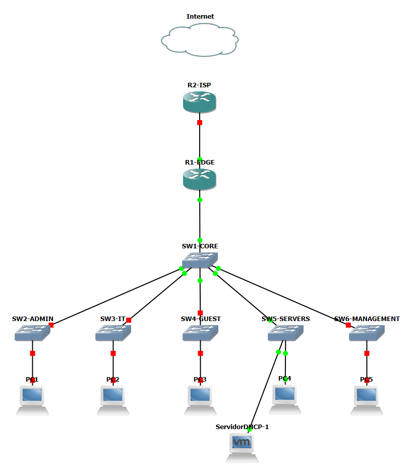
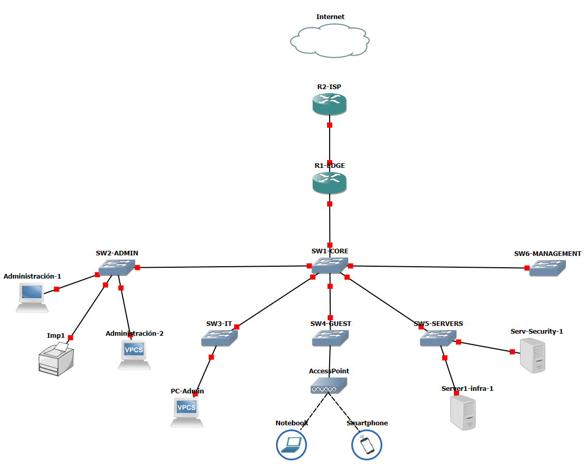

# Semana 2 - Infraestructura, DNS y NAT/PAT

Durante esta segunda etapa se amplió la infraestructura del laboratorio, incorporando una red dedicada de administración, resolución DNS interna y conectividad hacia una red externa simulada mediante NAT/PAT.

El objetivo fue completar la infraestructura base y centralizar servicios que permitan identificar y administrar los dispositivos de forma más ordenada.

    
---

## 📌 Objetivos de la semana

* Ampliar la topología incorporando los dispositivos necesarios para las siguientes etapas del laboratorio.
* Implementar una red dedicada de administración mediante la **VLAN 99 - Management**.
* Asignar direcciones IP de administración a los dispositivos de red.
* Implementar resolución DNS interna mediante el dominio `kit.enterprise.lab`.
* Registrar los dispositivos de infraestructura utilizando sus hostnames.
* Integrar DNS con el servicio DHCP para distribuir automáticamente el servidor DNS a los clientes.
* Implementar **NAT/PAT** para permitir que la red utilice una única dirección externa.

---

## Tecnologías más utilizadas en esta etapa

* Cisco IOS
* GNS3
* VLAN de Management
* Inter-VLAN Routing
* DNS
* NAT / PAT (NAT Overload)
* ACL estándar para identificación de tráfico NAT
* Routing estático

---

## 📋 Etapas de implementación

### 01 - Ampliación de infraestructura

Se amplió la topología inicial del laboratorio para incorporar los componentes necesarios para las siguientes etapas del proyecto, incluyendo la red de administración, el servidor de seguridad y una conexión hacia un ISP simulado.

> 📄 [Ver documentación](./01-ampliacion-infraestructura.md)

---

### 02 - Red de Management

Se implementó la **VLAN 99** como red dedicada para la administración de los dispositivos de infraestructura.

Se asignaron direcciones IP de Management al router y a los switches, habilitando la VLAN 99 en los enlaces trunk necesarios y verificando la conectividad hacia los dispositivos desde otras redes del laboratorio.

> 📄 [Ver documentación](./02-red-management.md)

---

### 03 - DNS interno

Se incorporó resolución DNS interna utilizando el dominio:

```text
kit.enterprise.lab
```

El servidor de infraestructura `192.168.50.10` quedó encargado de brindar los servicios de **DHCP y DNS**, permitiendo resolver los nombres de los dispositivos de red y distribuyendo automáticamente su dirección como servidor DNS a los clientes.

Esto permite acceder a los recursos utilizando nombres como:

```text
serv1-infra.kit.enterprise.lab
sw3-it.kit.enterprise.lab
r1-edge.kit.enterprise.lab
```

en lugar de depender únicamente de sus direcciones IP.

> 📄 [Ver documentación](./03-DNS-interno.md)

---

### 04 - NAT/PAT

Se configuró `R1-EDGE` como límite entre las redes privadas del laboratorio y una red externa simulada mediante `R2-ISP`.

Utilizando **PAT (NAT Overload)**, equipos pertenecientes a distintas VLANs pueden compartir la dirección externa de `R1-EDGE` para comunicarse con destinos externos.

La implementación fue validada generando tráfico simultáneo desde diferentes VLANs y verificando las traducciones dinámicas creadas por el router.

> 📄 [Ver documentación](./04-NAT.md)

---
# Resultado de la semana

* ✅ Infraestructura del laboratorio ampliada y organizada por segmentos.
* ✅ Red de administración implementada mediante la VLAN 99 y su direccionamiento configurado para routers y switches.
* ✅ Servicio DNS interno operativo bajo el dominio `kit.enterprise.lab`.
* ✅ Resolución por hostname de los dispositivos de infraestructura.
* ✅ Integración de DHCP y DNS para la configuración automática de los clientes.
* ✅ NAT/PAT operativo para múltiples VLANs utilizando una única dirección externa.
* ✅ Infraestructura preparada para avanzar con **ACLs, SSH y hardening**.


